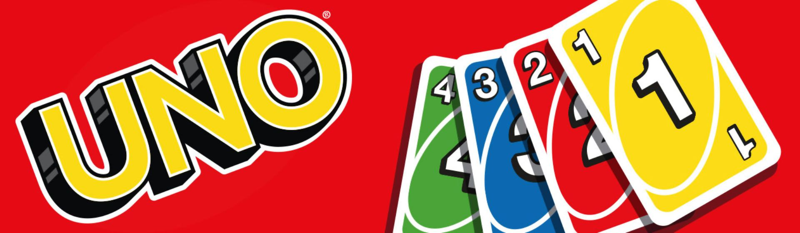

# Uno-Online

<!---Esses são exemplos. Veja https://shields.io para outras pessoas ou para personalizar este conjunto de escudos. Você pode querer incluir dependências, status do projeto e informações de licença aqui--->

<!-- 


 -->



> Uno Online para se divertir com os amigos.

### Ajustes e melhorias

O projeto ainda está em desenvolvimento e as próximas atualizações serão voltadas nas seguintes tarefas:

- [x] Tarefa 1

## 💻 Pré-requisitos

Antes de começar, verifique se você atendeu aos seguintes requisitos:

<!---Estes são apenas requisitos de exemplo. Adicionar, duplicar ou remover conforme necessário--->

- Você instalou a versão mais recente de `NodeJS / NPM`
- Você tem uma máquina `Windows / Linux / Mac`.
- Você leu `README, CONTRIBUTING`.

## 🚀 Instalando Uno Online

Para instalar o Uno Online, siga estas etapas:

Windows, Linux e macOS:

Necessário NodeJS instalado.

Rode o comando dentro das pastas 'server' e 'client':

```
npm install
```

Criar .env na pasta server:

```
API_PORT=3000
PASSWORD=minhasenha
```

## ☕ Usando Uno Online e Jogando com amigos!

Para usar Uno Online, siga estas etapas:
Abra a pasta 'server' e 'client' e rode o comando:

```
npm run start
```
Abra a pasta 'client' e rode o comando:
```
npx serve -l 2005 // você pode substituir o 2005 para qualquer número de porta
```
Irá informar um link para que você possa acessar.

Para convidar seus amigos para jogar, você precisará abrir a DMZ (conhecido também como abrir portas) do seu roteador.

Após isso, acesse esse site e copie o endereço de IP Público: https://meuip.com.br/

Copie o IP e adicione a porta nele, por exemplo:
```
127.0.0.1:PORTA
```

Adicione comandos de execução e exemplos que você acha que os usuários acharão úteis. Fornece uma referência de opções para pontos de bônus!

## 📫 Contribuindo para Uno Online

<!---Se o seu README for longo ou se você tiver algum processo ou etapas específicas que deseja que os contribuidores sigam, considere a criação de um arquivo CONTRIBUTING.md separado--->

Para contribuir com Uno Online, siga estas etapas:

1. Bifurque este repositório.
2. Crie um branch: `git checkout -b <nome_branch>`.
3. Faça suas alterações e confirme-as: `git commit -m '<mensagem_commit>'`
4. Envie para o branch original: `git push origin uno-online / <local>`
5. Crie a solicitação de pull.

Como alternativa, consulte a documentação do GitHub em [como criar uma solicitação pull](https://help.github.com/en/github/collaborating-with-issues-and-pull-requests/creating-a-pull-request).

## 🤝 Colaboradores

Agradecemos às seguintes pessoas que contribuíram para este projeto:

<table>
  <tr>
    <td align="center">
      <a href="#">
        <br>
        <sub>
          <b>4ndr3224</b>
        </sub>
      </a>
    </td>
    <td align="center">
      <a href="#">
        <br>
        <sub>
          <b>Guilherme S. Barros</b>
        </sub>
      </a>
    </td>
  </tr>
</table>

## 📝 Licença

Esse projeto está sob licença. Veja o arquivo [LICENÇA](LICENSE.md) para mais detalhes.

[⬆ Voltar ao topo](#Uno-Online)<br>
